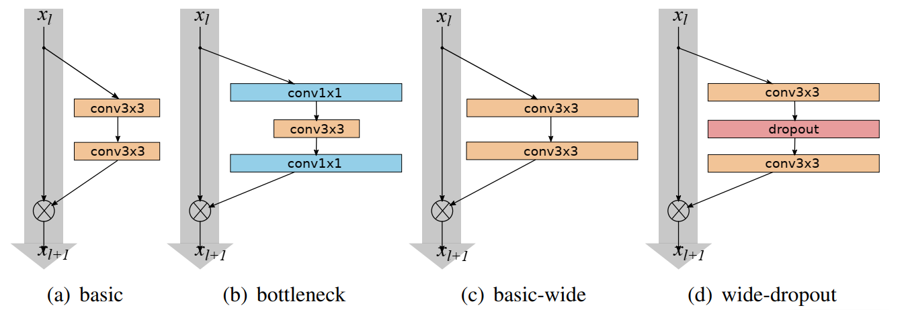
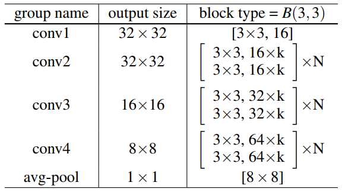
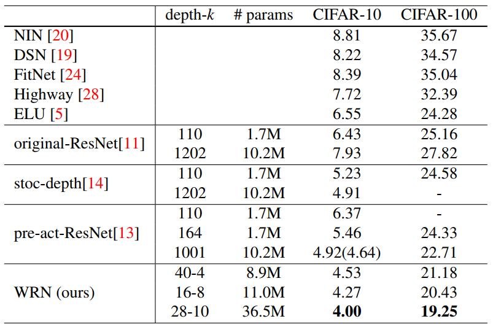

# WRN 详解

## 简介

卷积神经网络的发展经历了 AlexNet、VGGNet、Inception 到 ResNet 的发展过程，在如今的计算机视觉中层和上层任务中使用 ResNet 是一个很常见的选择，一方面其效果较好（无论是速度还是精度），另一方面其泛化能力很强（适合于以迁移学习为基础的计算机视觉任务）。ResNet 为更深的网络设计带来了充分的先决条件，但是，随着模型的加深，参数量迅速增加而带来的精度收益却比较小，Sergey Zagoruyko 等人认为过深的残差网络并不能带来较大的性能变化，可以改用宽而浅的网络来获得更好的效果，于是提出了 Wide Residual Networks（WRN），效果显著。

## 网络设计

### 先前问题

网络的深浅问题是一个讨论已久的话题，很多研究表明，在复杂性相同的情况下，浅层网络比深层网络多指数倍的部件。因此何恺明等人提出了残差网络，他们希望增加网络层数来使得网络很深并且有更少的参数。本文作者认为，包含 identity mapping 的残差模块允许训练很深的网络的同时，也带来了一些问题。梯度流经网络的时候，网络不会强制要求梯度流过残差块的权重层，这可能导致训练中几乎学不到什么。最后，只有少量的残差块能够学到有用的表达（绝大多数残差块用处不大）或者很多块分享非常少的信息，这对结果影响很小。

上述问题称为 diminishing feature reuse（特征复用缺失），本论文作者希望使用一种浅而宽的模型，来有效提升模型性能。在 ResNetv2 的基础上，以正确的方式加宽残差块提供了一种更加高效地提升残差网络性能的方法。提出的 Wide Residual Networks（WRN），在深度较浅，参数同等的情况下，获得不弱于深层网络的效果，且训练更快。并且，论文提出了一种新的 Dropout 使用方法，前人将 dropout 放在 identity 连接上，性能下降，作者认为，应该将 dropout 插入卷积层之间，并借此获得了新的 sota 效果。

### 设计贡献

1. 提出了对比实验，对残差网络进行了详细的实验研究；
2. 提出了 WRN，相对于 ResNet，性能有较大的提高；
3. 提出了深度残差网络中 dropout 使用的新思路，有效进行了正则化。

## WRN
残差网络中有两种类型的模块，分别为basic（包含两个3x3卷积，每个卷积紧跟BN层和Relu激活，如下图a）和bottleneck（包含被两个1x1卷积包裹的3x3卷积，1x1卷积用来进行维度调整，如下图b）。由于BN的位置后来实验证明改为BN、Relu、Conv训练得更快，所以这里不考虑原始的设计结构，而且因为bottleneck是为了加深网络而提出的，这里也不考虑，只在basic结构上修改。



作者提出有三种方法来增加残差模块的表示能力：
- 每个残差块增加更多的卷积层
- 通过增加特征面来增加卷积层宽度
- 增大卷积核尺寸

由于VGG和Inception研究表明小卷积有着更好的效果，所以对卷积核尺寸都控制在3x3以下，主要就是研究卷积层数目和卷积层宽度的影响。为此，引入了两个系数l（深度系数）和k（宽度系数），前者表示残差模块中的卷积层数目，后者表示特征面数（后文解释）。

提出了上图c和d的两种宽残差模块，下表详细描述了结构内部。



事实上，令k=1就会发现就是基础的ResNet论文中所用的结构，通道分别为16、32和64，堆叠$6*N+2$的深度。本文作者加了个系数k从而通过增加输出的通道数来控制较小的N从而实现更宽（wide）的网络。调整l和k保证网络的复杂性基本不变进行了各种结构的尝试。由于网络加宽使得参数量增加，需要更有效的正则化方法，BN虽然有效但是需要配合充分的数据增强，需要尽量避免使用，通过在每个残差块的卷积层之间增加dropout并在Relu后对下一个残差块中的BN进行扰动以防过拟合。在非常深的残差网络中，上述方法有助于解决特征重用问题。

在选择合适的残差块设计后（事实上效果差别不大），与其他网络在Cifar数据集上进行对比实验，结果如下图。WRN40-4与ResNet1001相比，参数量类似，结果类似，训练速度却快了很多。这表明，增加宽度对模型的性能是有提升的，但不能武断认为哪种更好，需要寻优配合才行，不过，同等参数，宽度网络比深度网络容易训练。



由于实验进行较多，这里不具体列举更多数据集上的实验结果了。

## 项目实战
我用Pytorch简单实现了WRN的网络结构（WRN28）并在Caltech101上进行了训练（原论文作者也在Github开源了代码，感兴趣可以直接访问，我的代码有参考原论文项目中Cifar数据集部分），具体的模型代码如下。
```python
import torch
import torch.nn as nn
import torch.nn.functional as F


class BasicBlock(nn.Module):
    def __init__(self, in_planes, out_planes, stride, dropout_prob=0.0):
        super(BasicBlock, self).__init__()
        self.bn1 = nn.BatchNorm2d(in_planes)
        self.relu1 = nn.ReLU(inplace=True)
        self.conv1 = nn.Conv2d(in_planes, out_planes, kernel_size=3, stride=stride, padding=1, bias=False)
        self.bn2 = nn.BatchNorm2d(out_planes)
        self.relu2 = nn.ReLU(inplace=True)
        self.conv2 = nn.Conv2d(out_planes, out_planes, kernel_size=3, stride=1, padding=1, bias=False)
        self.dropout_prob = dropout_prob
        self.in_is_out = (in_planes == out_planes)
        # 是否需要shortcut
        self.shortcut = (not self.in_is_out) and nn.Conv2d(in_planes, out_planes, kernel_size=1, stride=stride,
                                                           padding=0, bias=False) or None

    def forward(self, x):
        if not self.in_is_out:
            x = self.relu1(self.bn1(x))
        else:
            out = self.relu1(self.bn1(x))
        out = self.relu2(self.bn2(self.conv1(out if self.in_is_out else x)))
        if self.dropout_prob > 0:
            out = F.dropout(out, p=self.dropout_prob, training=self.training)
        out = self.conv2(out)
        return torch.add(x if self.in_is_out else self.shortcut(x), out)


class NetworkBlock(nn.Module):
    def __init__(self, nb_layers, in_planes, out_planes, block, stride, dropout_prob=0.0):
        super(NetworkBlock, self).__init__()
        self.layer = self._make_layer(block, in_planes, out_planes, nb_layers, stride, dropout_prob)

    def _make_layer(self, block, in_planes, out_planes, nb_layers, stride, dropRate):
        layers = []
        for i in range(int(nb_layers)):
            layers.append(block(i == 0 and in_planes or out_planes, out_planes, i == 0 and stride or 1, dropRate))
        return nn.Sequential(*layers)

    def forward(self, x):
        return self.layer(x)


class WideResNet(nn.Module):
    def __init__(self, depth, num_classes=101, k=1, dropout_prob=0.0):
        super(WideResNet, self).__init__()
        n_channels = [16, 16 * k, 32 * k, 64 * k]
        assert ((depth - 4) % 6 == 0)
        n = (depth - 4) / 6
        block = BasicBlock
        self.conv1 = nn.Conv2d(3, n_channels[0], kernel_size=3, stride=1, padding=1, bias=False)
        # block1
        self.block1 = NetworkBlock(n, n_channels[0], n_channels[1], block, 1, dropout_prob)
        # block2
        self.block2 = NetworkBlock(n, n_channels[1], n_channels[2], block, 2, dropout_prob)
        # block3
        self.block3 = NetworkBlock(n, n_channels[2], n_channels[3], block, 2, dropout_prob)

        self.bn1 = nn.BatchNorm2d(n_channels[3])
        self.relu = nn.ReLU(inplace=True)
        self.fc = nn.Linear(n_channels[3], num_classes)
        self.n_channels = n_channels[3]

        # 参数初始化
        for m in self.modules():
            if isinstance(m, nn.Conv2d):
                nn.init.kaiming_normal_(m.weight, mode='fan_out', nonlinearity='relu')
            elif isinstance(m, nn.BatchNorm2d):
                m.weight.data.fill_(1)
                m.bias.data.zero_()
            elif isinstance(m, nn.Linear):
                m.bias.data.zero_()

    def forward(self, x):
        out = self.conv1(x)
        out = self.block1(out)
        out = self.block2(out)
        out = self.block3(out)
        out = self.relu(self.bn1(out))
        out = F.avg_pool2d(out, 1)
        out = out.view(-1, self.n_channels)
        return self.fc(out)
```
简单可视化训练过程（loss图）。


## 补充说明
本文其实相对是比较简单的论文，验证了宽度给模型性能带来的提升，为很多网络结构设计提供了新的思路，我在很多上层计算机视觉任务的特征提取网络中都看到了WRN的影子，是非常实用的残差网络思路。最后的实现代码可以在我的Github访问到，欢迎star或者fork。

## 参考论文

[Zagoruyko S, Komodakis N. Wide residual networks[J]. arXiv preprint arXiv:1605.07146, 2016.](https://arxiv.org/abs/1605.07146)
